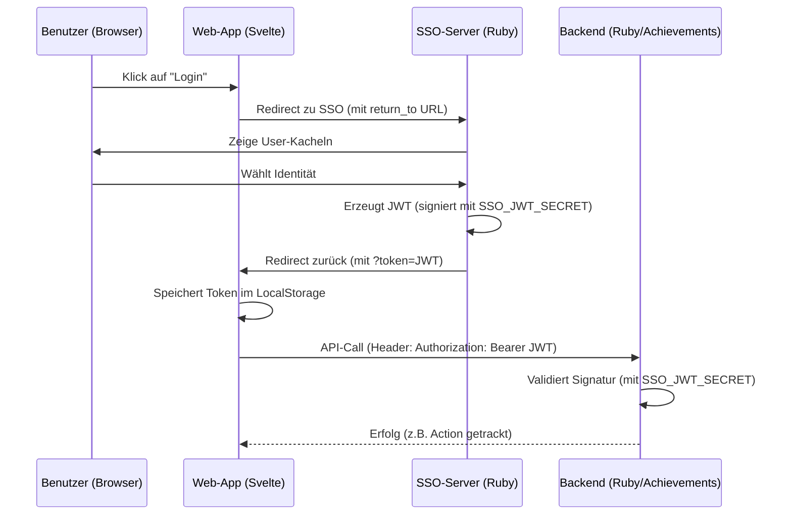

# Authentifizierung & SSO Architektur

MDTutor nutzt ein dezentrales Authentifizierungsmodell, das auf **SSO (Single Sign-On)** und **JWT (JSON Web Tokens)** basiert. Dieses Dokument beschreibt das Zusammenspiel der beteiligten Komponenten.

## Architektur-Übersicht

Die Authentifizierung ist vom eigentlichen Anwendungs-Backend getrennt. Dies erlaubt es, verschiedene Dienste (Achievements, Inhalts-Server, etc.) mit derselben Identität zu nutzen.



## Beteiligte Komponenten

### 1. SSO-Server (`packages/sso-server`)
- **Aufgabe**: Identitätsgeber (Identity Provider).
- **Konfiguration**: Benutzer und Admins sind in `config/users.yaml` definiert.
- **Technik**: Nutzt Rails mit Phlex für eine schnelle, font-unabhängige UI (SVGs).
- **Token**: Erzeugt bei Auswahl eines Users ein JWT, das `user_id`, `name`, `admin` und `avatar` enthält.

### 2. Web-App (`apps/web`)
- **Aufgabe**: Konsument der Identität.
- **Speicherung**: Der Token wird im `localStorage` unter dem Schlüssel `sso_token` abgelegt.
- **Handhabung**: Die `auth.ts` Store-Logik prüft beim Start die URL auf neue Tokens und bereinigt diese sofort (`window.history.replaceState`), um die URL sauber zu halten.

### 3. Backend-Ruby (`packages/backend-ruby`)
- **Aufgabe**: Ressourcen-Server (Resource Provider).
- **Validierung**: Prüft bei jedem geschützten Request (via `authenticate_user!`), ob ein gültiger JWT vorhanden ist.
- **Vertrauen**: Das Backend muss den SSO-Server nicht kontaktieren. Es vertraut der kryptografischen Signatur, da es dasselbe `SSO_JWT_SECRET` wie der SSO-Server kennt.

## Sicherheit & Details

### Das Shared Secret
Die Sicherheit des gesamten Systems hängt vom `SSO_JWT_SECRET` ab (definiert in der `.env`). 
- **SSO-Server**: Nutzt es zum **Verschlüsseln/Signieren**.
- **Backend**: Nutzt es zum **Entschlüsseln/Verifizieren**.

### Logout-Mechanismus
Da wir keine serverseitigen Sessions nutzen (Stateless API), funktioniert der Logout wie folgt:
1. App leitet zum SSO-Server um.
2. SSO-Server bietet Button "Abmelden".
3. Redirect zurück zur App mit `?token=logout`.
4. App löscht daraufhin den Token aus dem `localStorage`.

## Token-Struktur (Payload)
Ein typisches Token enthält:
```json
{
  "user_id": "mentor_1",
  "name": "Mentor (Thomas)",
  "admin": true,
  "avatar": "/avatars/admin.svg",
  "exp": 1767366961
}
```
`exp` sorgt dafür, dass Tokens automatisch nach 24 Stunden ablaufen.

