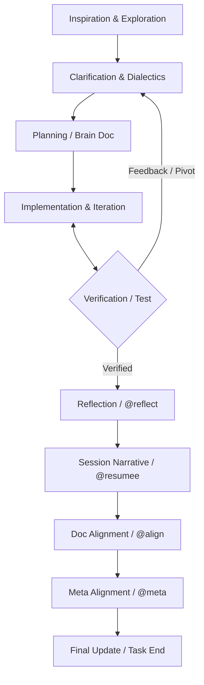

# Conversational Architecture (ConvArc) Workflow

This document defines the discursive development process for MDTutor. ConvArc places the dialogue between the user and the agent at the center of the architectural evolution, using the Severin framework as its guardian of integrity.

## The ConvArc Cycle

The development process is non-linear and iterative. We move between conceptual exploration and technical manifestation, constantly refining our mental models and technical implementations.

### Phases Description

1.  **Inspiration & Exploration**: The initial spark or problem statement. Often vague and conceptual.
2.  **Clarification & Dialectics**: The process of "haggling" over ideas to understand the underlying patterns and intents. **(Prompt: `@clarify`)**
3.  **Planning (Brain Doc)**: Crystallizing the intent and technical steps into a committed plan. **(Prompt: `@plan`)**
4.  **Implementation & Iteration**: Building the code. This is often a loop where technical reality informs further clarification. **(Prompt: `@implement`)**
5.  **Verification (Test)**: Explicit proof of functional correctness via RSpec or manual functional tests.
6.  **Reflection (@reflect)**: Analytical look at process friction and framework gaps. **(Prompt: `@reflect`)**
7.  **Session Narrative (@resumee)**: Capturing the "Discourse Trace"—the story of how we arrived at the current state, written in the original conversation language (German). **(Prompt: `@resumee`)**
8.  **Doc Alignment (@align)**: Synchronizing the technical reality (code) with public documentation (READMEs). **(Prompt: `@align`)**
9.  **Meta Alignment (@meta)**: Feeding workflow insights back into the Severin rules and this Meta-README. **(Prompt: `@meta`)**
10. **Final Update**: A last pass over the documentation to ensure everything is "ship-ready."

## The Role of Severin

Severin is not a single step in the cycle; it is the **Integrity Foundation**. It accompanies every phase by:
-   **Permanent Monitoring**: Ensuring RID consistency, path integrity, and rule compliance during every run (`sv check`).
-   **Skill-Based Guidance**: Dynamically injecting relevant context and rules based on the current task state.
-   **Fail-Fast Integrity**: Aborting execution early if the infrastructure (like MCP servers) or core principles are violated.

## Core Principles

-   **Observability by Design**: Every technical change must be traceable via persistent logs.
-   **Discourse over Tickets**: The conversation history is the primary record of architectural intent.
-   **Emergent Patterns**: We actively look for recurring problems to codify them into new Severin skills.

