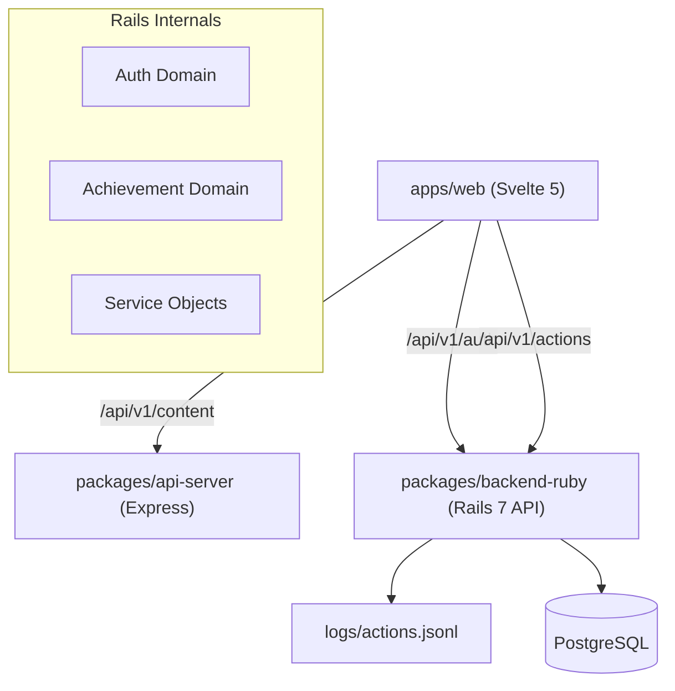

# Plan: Achievements- & Auth-Server (Rails API)

Wir ersetzen den ursprünglichen Sinatra-Ansatz durch eine robuste Rails API-Anwendung, um Discourse-ähnliche Patterns (Services, Serializer) zu ermöglichen und für PostgreSQL vorbereitet zu sein.

## Architektur

## Komponenten

### 1. packages/backend-ruby (Rails API)
- **Framework**: Rails 7 im `--api --minimal` Modus.
- **Datenbank**: SQLite (für Dev), PostgreSQL (vorbereitet), primärer Log-Output in `actions.{env}.jsonl`.
- **Patterns**:
    - **Service Objects**: Logik für `TrackActionService`.
    - **Controllers**: `ActionsController` und `SessionsController` (Fake SSO).
- **Endpoints**:
    - `POST /api/v1/actions`: Loggen von `project_open`, `task_check`, etc.
    - `POST /api/v1/auth/login`: Einfaches SSO-Mocking.
    - `DELETE /api/v1/auth/logout`: Abmelden.
    - `GET /api/v1/auth/me`: Aktueller User.

### 2. apps/web Integration
- **AchievementService**: Svelte-Lib zum Senden von Telemetrie-Daten.
- **AuthStore**: Svelte-Store für den aktuellen Benutzerstatus.
- **LoginBar**: UI Komponente für den User-Wechsel.

## Dateisystem-Änderungen
- `packages/backend-ruby/` (Komplette Rails-Struktur)
- `apps/web/src/lib/achievements.ts`
- `apps/web/src/lib/auth.ts`
- `apps/web/src/lib/LoginBar.svelte`
- `.env` (Hinzufügen von `RAILS_PORT`)

