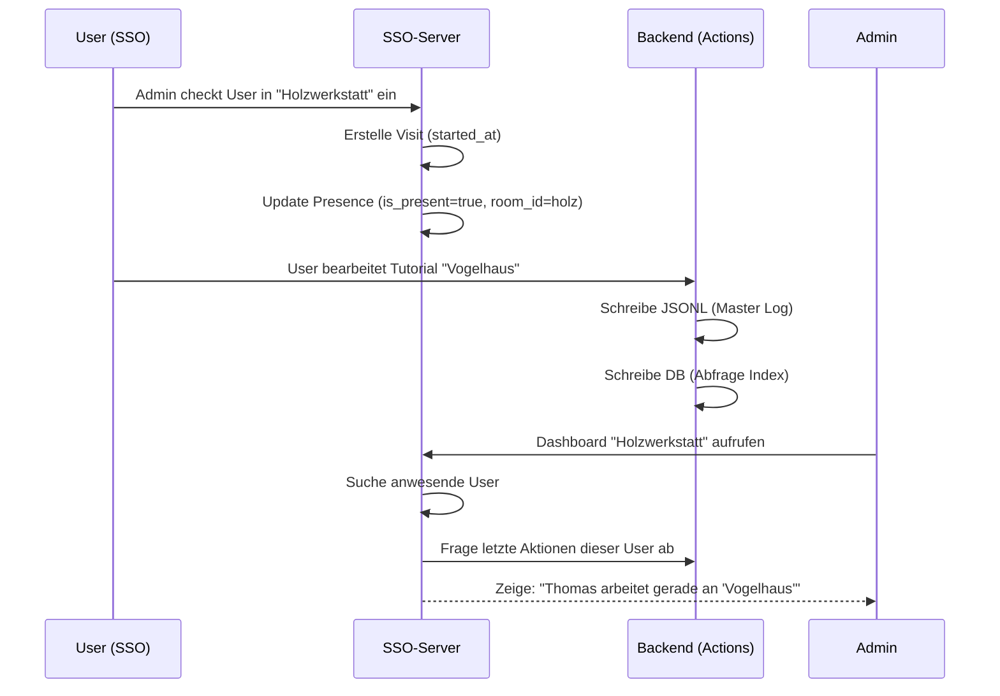

# Implementation Plan: Makerspace Management (Rooms & History) 🔹sloTk

Dieses Dokument beschreibt die Erweiterung des SSO- und Achievement-Systems um eine Raum-Verwaltung, Besuchs-Historie und Echtzeit-Arbeitsübersichten.

## Zielsetzung
- **Räume**: Definition von physischen Räumen (z.B. "Holzwerkstatt", "Elektronik-Labor").
- **Präsenz 2.0**: Nutzer können in spezifischen Räumen ein- und ausgecheckt werden.
- **Besuchs-Log**: Lückenlose Protokollierung der Aufenthaltszeiten pro User und Raum.
- **Arbeits-Dashboard**: Übersicht "Wer ist gerade wo?" und "Woran wird gerade gearbeitet?".
- **Daten-Integrität**: JSONL bleibt als "Raw Action Log" erhalten, die DB dient als Abfrage-Index.

## Architektur & Datenmodell

### SSO-Server (Präsenz-Infrastruktur)
- **Room**: `id`, `name`, `slug`.
- **Presence**: Update um `room_id` (beliebig viele parallele Räume möglich oder Single-Room Fokus).
- **Visit**: `user_id`, `room_id`, `started_at`, `ended_at`.

### Backend-Ruby (Aktions-Index)
- **Action (DB)**: `user_id`, `action_type`, `gid`, `metadata`, `timestamp`.
- **TrackActionService**: Schreibt redundant in **DB AND JSONL**.

## Workflow

## Umsetzungsschritte

### 1. Räume & Besuche (SSO-Server)
- Migrationen für `rooms` und `visits`.
- Update `Presence` Logik (Check-in erzeugt Visit, Check-out beendet Visit).

### 2. Duales Logging (Backend-Ruby)
- Erstelle `Action` Model und Migration.
- Update `TrackActionService` für paralleles Schreiben (DB + JSONL).

### 3. Raum-Übersicht & Logs (UI)
- Phlex View für Besuchs-Historie (pro User/Raum).
- "Who is where?" Dashboard.

