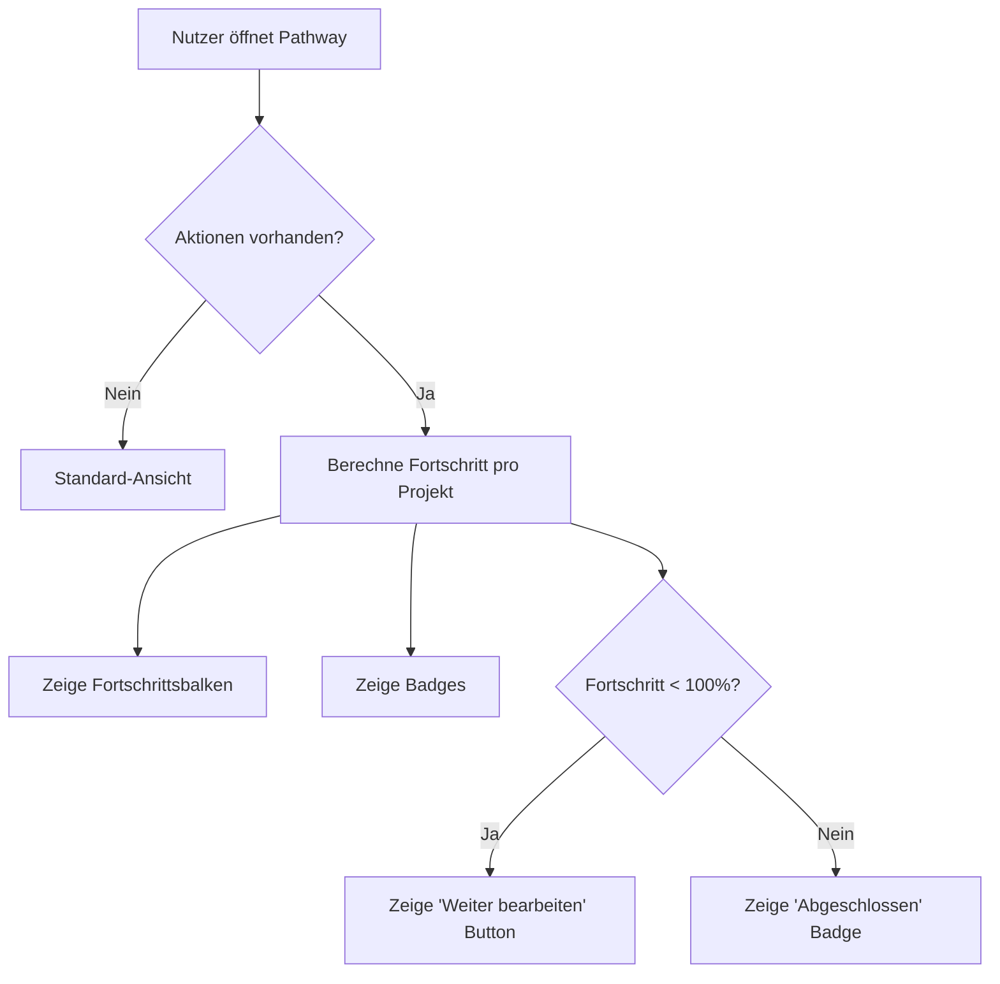

# Implementation Plan: Pathway Achievements & Progress

Dieses Dokument beschreibt die Erweiterung der Pathway-Ansicht um detaillierte Fortschrittsanzeigen, Badges und "Weiter bearbeiten"-Buttons.

## Erreichte Meilensteine (Status Quo)
- **SSO & Auth**: Eigenständiger SSO-Server mit JWT, PIN-Schutz und Admin-Super-Mode.
- **Präsenz-System**: Raum-Verwaltung (Rooms) und Besuchs-Historie (Visits).
- **Aktions-Logging**: Duales Logging (JSONL + DB) im Ruby-Backend.
- **UUIDs**: Konsistente Nutzung von UUIDs (bzw. Strings für SQLite) für alle neuen Entitäten.
- **Testing**: RSpec-Suites für beide Rails-Apps.

## Neuer Plan: Pathway Achievements

### 1. Datenmodell & Logik
- **Fortschrittsberechnung**: 
  - Jeder Step im Projekt zählt anteilig (100 / Anzahl Steps).
  - Innerhalb eines Steps zählen Subtasks (Checkboxen) und Quizzes anteilig zum Step-Fortschritt.
  - Formel: `StepScore = (completedTasks + (quizPassed ? 1 : 0)) / totalInteractionsPerStep`
- **Badges**: Jedes Projekt hat ein Badge, das bei 100% Fortschritt "freigeschaltet" (farbig) wird.

### 2. UI-Komponenten (Svelte 5)
- **Fortschritts-Indikator**: Diskrete Anzeige (z.B. Prozent oder Balken) auf der Projektkarte.
- **"Weiter bearbeiten"-Button**: Erscheint nur bei Projekten mit Fortschritt > 0% und < 100%. Verlinkt zum zuletzt aktiven Step.
- **Badge-Display**: Anzeige der Projekt-Badges.
- **i18n**: Texte für "Weiter bearbeiten" (`continue_editing`).

### 3. API-Erweiterung
- Neuer Endpunkt oder Parameter im `backend-ruby`, um alle Aktionen eines Users für einen spezifischen Pathway effizient abzufragen (`GET /api/v1/actions/pathway/:slug`).

## Mermaid Workflow

