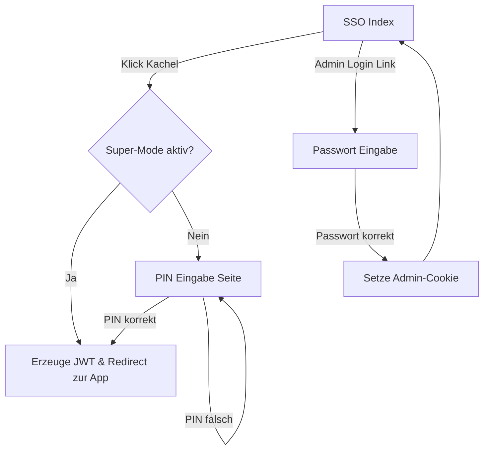

# Implementation Plan: SSO Kiosk Security (PIN & Super-Mode)

Dieses Dokument beschreibt die Erweiterung des SSO-Servers um einen gesicherten Kiosk-Modus.

## Zielsetzung
- **Normalbetrieb**: Nutzer müssen nach Auswahl ihrer Kachel eine 4-stellige PIN eingeben.
- **Super-Mode**: Ein Admin kann sich per Passwort einloggen. Solange die Admin-Session aktiv ist, entfällt die PIN-Abfrage für alle Nutzer (freier Wechsel).
- **Sicherheit**: PINs und Passwörter werden einfach in der `users.yaml` hinterlegt (für die aktuelle Projektphase ausreichend).

## Architektur & Datenfluss

## Umsetzungsschritte

### 1. Konfiguration (`packages/sso-server/config/users.yaml`)
Erweiterung der User-Daten:
- Admins erhalten ein `password`.
- User erhalten eine `pin`.

### 2. Controller-Logik (`packages/sso-server/app/controllers/sessions_controller.rb`)
- `index`: Erkennt Admin-Session und gibt Status an View weiter.
- `create`: 
    - Wenn Super-Mode: Direkt einloggen.
    - Wenn kein Super-Mode: Redirect zu `pin_request`.
- `verify_pin`: Prüft die eingegebene PIN und erzeugt dann erst das JWT.
- `super_login`: Validiert Admin-Passwort und setzt verschlüsselten Session-Cookie.
- `admin_logout`: Löscht Admin-Cookie.

### 3. Views (Phlex)
- `Sessions::IndexView`: Zeigt "Super-Mode aktiv" Banner und Admin-Logout Link.
- `Sessions::PinView`: Einfaches 4-Tasten-Feld oder Input für PIN.
- `Sessions::SuperLoginView`: Formular für Admin-Passwort.

### 4. Routing (`packages/sso-server/config/routes.rb`)
Neue Routen für PIN-Verifikation und Admin-Login.

## Zeitplan
1. Config & Modell-Logik (UserLoader)
2. PIN-Workflow (View & Verify)
3. Admin-Super-Mode (Login/Logout & Session)
4. UI-Finishing

